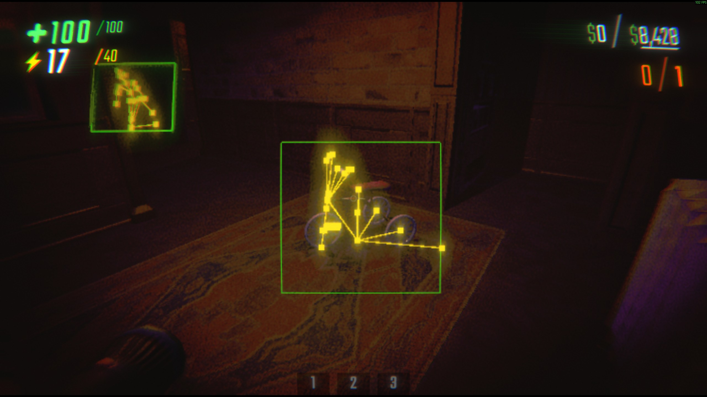

# REPO ESP — BepInEx 插件



给 REPO（Mono, Unity 2022.3）怪物画 **2D 屏幕方框** + **骨骼点线**。
绘制走 `Camera.onPostRender` + GL（不依赖 OnGUI），游戏内按 `F6` 开关。

## 工作原理

- 敌人枚举：优先 `EnemyParent` 类型（`Resources.FindObjectsOfTypeAll`），找不到时退回按 `Enemy*` 名字找
- 方框：合并怪物所有 `MeshRenderer` / `SkinnedMeshRenderer` 的 bounds（排除粒子/拖尾），8 角投影后取屏幕 min/max 画 2D 矩形
- 骨骼：遍历名字以 `ANIM` 开头的 Transform 节点，画黄点 + 父子连线（无 `ANIM` 节点时退回 `VISUALS` 子树）
- 渲染：`Camera.onPostRender` 静态回调 + `GL.LoadPixelMatrix` 画线，组件即使被销毁回调依然存活

## 编译

### 方法 A：Visual Studio 2022 Community（推荐）
1. 安装时勾选 ".NET 桌面开发" 工作负载
2. 打开 `RepoEsp.csproj`
3. `生成 → 生成解决方案`
4. 输出在 `repo_esp\bin\RepoEsp.dll`

### 方法 B：.NET SDK 命令行
```bash
dotnet build RepoEsp.csproj -c Release
# 输出在 repo_esp\bin\RepoEsp.dll
```
（`Microsoft.NETFramework.ReferenceAssemblies` 包会自动下载 net472 引用程序集）

## 安装

```
mkdir "E:\SteamLibrary\steamapps\common\REPO\BepInEx\plugins\RepoEsp"
copy repo_esp\bin\RepoEsp.dll "E:\SteamLibrary\steamapps\common\REPO\BepInEx\plugins\RepoEsp\"
```

重启游戏。开一局，怪物出现后应该能看到：
- 绿色 2D 方框（紧贴怪物）
- 黄色骨骼点 + 骨骼连线

## 排错

- 没显示：游戏内按 `F6`（默认开启，可能在切换时关了）
- 日志位置：`BepInEx\LogOutput.log`，搜索 `[RepoEsp]`
- 每 5 秒会打一条 `status: draw=... enemies=... renderers=...`
- 若 `Input` 报错被吞掉，说明游戏启用新版 Input System，F6 不可用——去掉按键开关，默认常开即可
